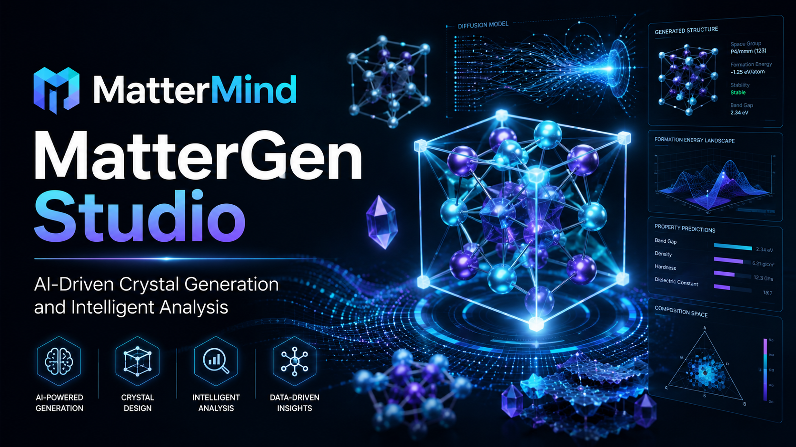

# MatterMind

MatterMind is a unified web workspace for generative materials design and first-principles simulation workflows.

It combines:

- MatterGen crystal generation
- VASP standard HDF5 runs
- VTST NEB workflows
- Wannier SCF / post-processing
- postw90 property workflows
- structured post-processing, artifact download, AI analysis, and chat

This repository contains the orchestration layer and UI. It does not include proprietary binaries, licensed pseudopotentials, or private experiment data.

## 🎬 VASP Studio Demo
https://github.com/user-attachments/assets/d26346dd-3d55-4657-bbcd-aabcdce66615

## 🎬 MatterGen Studio Demo


https://github.com/user-attachments/assets/e3ed827e-97dc-487c-9c72-e482f26f85a8


## What It Does

### MatterGen workspace

- Launch unconditioned or property-conditioned MatterGen jobs
- Support common conditioning targets such as chemical system, space group, band gap, magnetic density, bulk modulus, and multi-condition combinations
- Collect generated structures, metrics, images, and downloadable artifacts
- Run AI-generated result analysis and follow-up chat from `metrics.json`

### VASP workspace

- Standard HDF5 workflow with structured post-processing and plot generation
- VTST NEB workflow with both `pre_relaxed` and `relax_first` modes
- Wannier SCF workflow for producing SCF outputs used in later Wannier steps
- Wannier post workflow derived from a successful SCF job
- postw90 derived workflows on top of a successful Wannier job

Supported postw90 modules in the current UI/backend:

- Band interpolation
- DOS
- Berry / anomalous Hall conductivity
- Fermi surface
- BoltzWann transport

### Platform capabilities

- React/Vite single-page UI
- FastAPI backend
- Celery workers with Redis broker/backend
- live log streaming with SSE
- job status polling
- artifact download
- saved analysis and chat history
- optional AI interpretation via DashScope-compatible OpenAI API

## Architecture

```text
frontend (React + Vite)
    |
    v
backend (FastAPI)
    |
    +--> Celery worker: MatterGen jobs
    +--> Celery worker: VASP / VTST / Wannier / postw90 jobs
    |
    v
Redis

External executables / environments:
- MatterGen CLI
- VASP (HDF5 build and plain build)
- VTST scripts
- Wannier90 / postw90
- mpirun
```

## Repository Layout

```text
.
├── backend/
│   ├── app/
│   │   ├── main.py
│   │   ├── tasks.py
│   │   ├── vasp_postprocess.py
│   │   ├── vtst_postprocess.py
│   │   ├── wannier_postprocess.py
│   │   └── postw90_postprocess.py
│   ├── run_api.sh
│   ├── run_worker.sh
│   ├── run_worker_mattergen.sh
│   └── run_worker_vasp.sh
├── frontend/
│   ├── src/
│   ├── package.json
│   └── .env.example
└── run_all.sh
```

## Tech Stack

- Frontend: React 18, Vite, react-markdown
- API: FastAPI, Uvicorn
- Queue: Celery, Redis
- Materials / post-processing: ASE, pymatgen, spglib, SeeK-path, py4vasp, matplotlib
- AI analysis: OpenAI-compatible client against DashScope-compatible endpoint

## Quick Start

### 1. Prerequisites

Recommended environment:

- Linux
- Node.js 18+
- Python 3.10 for the worker environments
- Redis
- `tmux` if you want to use the one-command launcher
- `mpirun`

Required external software that is not bundled in this repo:

- MatterGen
- VASP
- VTST scripts
- Wannier90 / postw90

### 2. Install dependencies

Backend API / shared environment:

```bash
pip install -r backend/requirements.txt
```

MatterGen worker environment:

```bash
pip install -r backend/requirements-mattergen-worker.txt
```

VASP worker environment:

```bash
pip install -r backend/requirements-vasp-worker.txt
```

Frontend:

```bash
cd frontend
npm install
```

### 3. Configure environment

The provided shell scripts are currently opinionated for a Linux server layout and default to paths under `/root/autodl-tmp/...`.

At minimum, you should review or override:

- `REDIS_URL`
- `MATTERGEN_REPO`
- `RESULTS_BASE_DIR`
- `VASP_RESULTS_BASE_DIR`
- `VASP_HDF5_HOME`
- `VASP_PLAIN_HOME`
- `VTST_SCRIPTS_DIR`
- `WANNIER90_HOME`
- `VASP_EXECUTABLE`
- `VASP_MAX_NPROC`

If you want AI analysis and chat:

- `DASHSCOPE_API_KEY`
- optional: `DASHSCOPE_BASE_URL`
- optional: `DASHSCOPE_MODEL`

Frontend API base can be configured with:

```bash
VITE_API_BASE=http://127.0.0.1:8000
```

### 4. Start services

Start API:

```bash
bash backend/run_api.sh
```

Start workers:

```bash
bash backend/run_worker.sh both
```

Start frontend:

```bash
cd frontend
npm run dev
```

If your environment matches the scripted layout, you can also try:

```bash
bash run_all.sh
```

`run_all.sh` starts API, workers, and frontend together, and attaches to a `tmux` session when `tmux` is available.

## Core Workflows

### MatterGen

1. Select a MatterGen model
2. Optionally set conditioning targets
3. Launch generation
4. Inspect metrics, structures, images, and downloads
5. Run AI analysis and chat on the generated results

### Standard VASP

1. Upload `INCAR`, `POSCAR`, `POTCAR`, `KPOINTS`
2. Launch a standard HDF5 run
3. Review metrics and generated plots
4. Run AI analysis/chat on the post-processed results

### VTST NEB

1. Choose `pre_relaxed` or `relax_first`
2. Upload the required endpoint and NEB inputs
3. Stream logs during execution
4. Review barrier plots, `neb.dat`, and structured NEB metrics

### Wannier and postw90

1. Run a Wannier SCF job
2. Launch a Wannier post job from a successful SCF source job
3. Launch a postw90 derived job from a successful Wannier job
4. Review generated transport / band / DOS / Berry / Fermi-surface outputs

## API Overview

Main endpoint groups:

- `/api/jobs*` for MatterGen jobs
- `/api/vasp/jobs*` for VASP-family workflows
- `/health` for service health

The backend supports:

- job submission
- job listing and detail lookup
- streaming logs
- metrics retrieval
- analysis generation
- chat history and streaming replies
- artifact download
- VASP job stop requests

## Important Notes

- This repo does not ship VASP binaries, Wannier90 binaries, or licensed pseudopotentials such as `POTCAR`.
- Private experiment outputs and heavy raw data are intentionally excluded from version control.
- The current launch scripts are Linux/HPC oriented and assume bash-style tooling.
- AI analysis is optional. The rest of the job orchestration can run without it.

## Why This Repo Exists

MatterMind is intended to reduce the friction between generative materials discovery and downstream simulation validation.

Instead of treating MatterGen, VASP, VTST, Wannier, postw90, metrics parsing, and result interpretation as disconnected scripts, this project puts them behind one UI and one API so the workflow becomes traceable, repeatable, and easier to operate.
