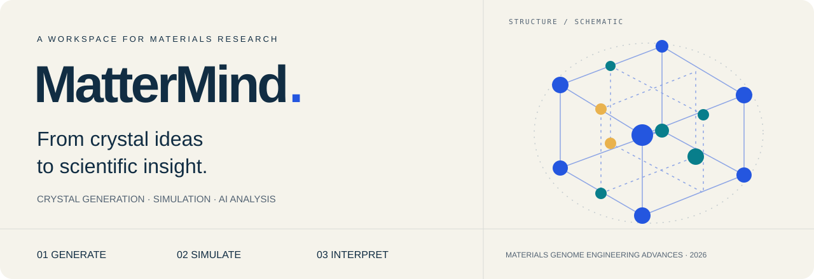
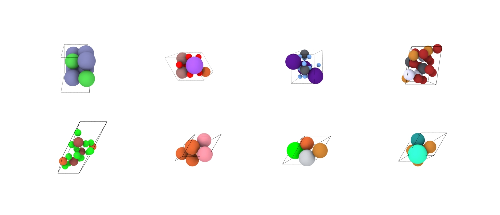
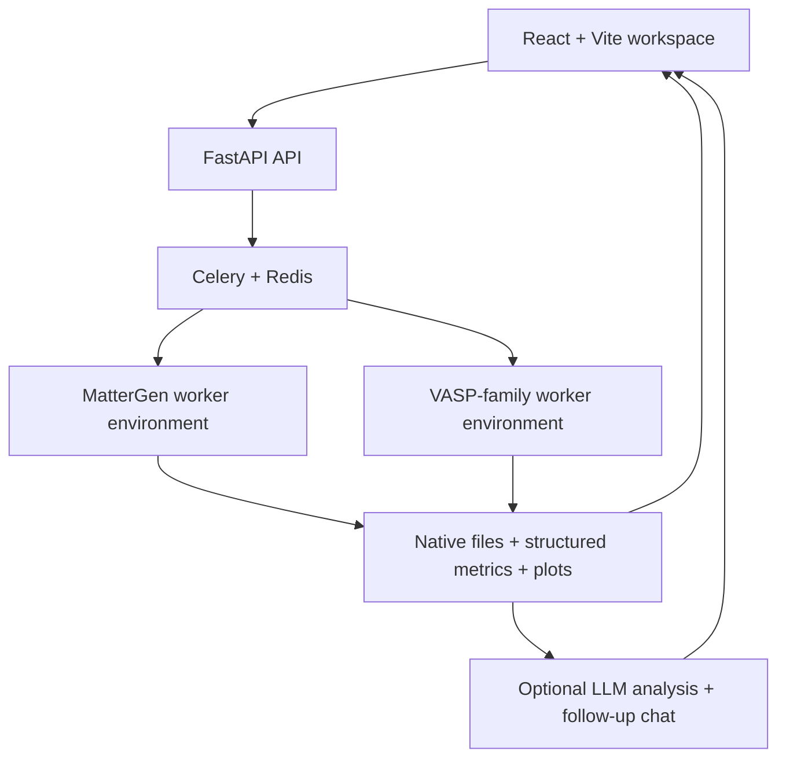

<div align="center">

[](https://yujun-lu.github.io/MatterMind/)

**Crystal generation · Materials simulation · AI-guided analysis**

[](https://doi.org/10.1002/mgea.70075)
[](https://doi.org/10.1002/mgea.70075)
[](https://yujun-lu.github.io/MatterMind/)
[](guidance/REPRODUCIBILITY.md)

[**Project website ↗**](https://yujun-lu.github.io/MatterMind/) · [Journal article](https://doi.org/10.1002/mgea.70075) · [Extended manuscript](docs/papers/mattermind-preprint.pdf) · [Get started](guidance/SETUP.md) · [Cite](#citation)

</div>

## One workspace, from structures to understanding

**MatterMind** connects generative crystal design, first-principles calculation, structured post-processing, and LLM-assisted interpretation in a browser-based research workspace. Submit a job, follow its logs, inspect its scientific outputs, and ask questions grounded in the saved results.

Two execution branches — **MatterGen** and **VASP-family workflows** — turn native outputs into reusable metrics, plots, and downloadable artifacts. The optional LLM layer helps explain those results while preserving access to the computational evidence.

> **Research context.** The journal article introduces the original VASP–MatterGen–LLM platform. The extended manuscript documents the broader system in this repository, including HDF5 parsing, VTST/CI-NEB, Wannier90, and postw90. These are distinct works with different author lists. Reported examples are platform demonstrations; successful execution alone does not establish physical validity.

## Explore the workflows

| Workflow | What you can do | Inspectable outputs |
| --- | --- | --- |
| **Generate · MatterGen** | Sample unconditioned or property-conditioned crystals; inspect symmetry, geometry, and diversity | CIF files, previews, descriptors, `metrics.json` |
| **Simulate · VASP** | Submit inputs, monitor calculations, and parse HDF5 results | Structural and electronic summaries, plots, native outputs |
| **Trace pathways · VTST / CI-NEB** | Use pre-relaxed endpoints or relax endpoints first | Image energies, barrier profiles, convergence diagnostics |
| **Localize · Wannier90** | Chain SCF preparation and Wannier post-processing | Spreads, centers, Hamiltonians, quality diagnostics |
| **Reconstruct · postw90** | Run band, DOS, Berry/AHC, Fermi-surface, or BoltzWann modules | Interpolated properties and visualization-ready artifacts |
| **Interpret · LLM assistance** | Request explanations and continue a scientific conversation | Saved analysis and follow-up chat grounded in extracted metrics |

Module availability depends on installed scientific engines and configuration. See the [setup guide](guidance/SETUP.md).

## Research in view

<a href="https://yujun-lu.github.io/MatterMind/#research"></a>

*Eight representative structures from the extended manuscript's 16-candidate unconditioned generation example (Figure 4, p. 13).*

| Example | What it demonstrates | Evidence and scope |
| --- | --- | --- |
| **Si, Au, SiAu₃** · journal | Relaxation, DOS, and AI interpretation | Individual structural sanity checks; [Figure 2](docs/papers/mattermind-published.pdf#page=6) |
| **Crystal generation** · extended manuscript | Export, symmetry, deduplication, and geometric screening | A separate space-group-225 demonstration reports **16/16 processed, 0/16 strict target hits** among unrelaxed candidates; [pp. 14–17](docs/papers/mattermind-preprint.pdf#page=14) |
| **SrTiO₃** · extended manuscript | HDF5 analysis and a **14-orbital** Wannier model | Model size is not an accuracy score; [Figure 8](docs/papers/mattermind-preprint.pdf#page=22) |
| **bcc Fe with SOC** · extended manuscript | Spinor Wannier processing, AHC exploration, and Fermi-surface export | Requires further convergence checks; XCrySDen visualization is external; [pp. 30–33](docs/papers/mattermind-preprint.pdf#page=30) |

Read the [reproducibility](guidance/REPRODUCIBILITY.md) and [source/version notes](guidance/SOURCES.md) before quantitative reuse. Unresolved NEB and Fe parser discrepancies are not presented as validated benchmark results.

## Watch MatterMind

| VASP Studio | MatterGen Studio |
| --- | --- |
| [](https://github.com/user-attachments/assets/8375afbe-3c6c-49a6-a2cb-4fb44e15b42c) | [](https://github.com/user-attachments/assets/43bf0146-9f53-4edc-ae49-213472dfef97) |
| [Watch the VASP walkthrough ↗](https://github.com/user-attachments/assets/8375afbe-3c6c-49a6-a2cb-4fb44e15b42c) | [Watch the MatterGen walkthrough ↗](https://github.com/user-attachments/assets/43bf0146-9f53-4edc-ae49-213472dfef97) |

*Thumbnails are promotional artwork. Refer to the recordings, source code, and paper figures for the interface and scientific results.*

## How it fits together


```mermaid
flowchart TD
    UI[React + Vite workspace] --> API[FastAPI API]
    API --> Q[Celery + Redis]
    Q --> MG[MatterGen worker environment]
    Q --> VS[VASP-family worker environment]
    MG --> OUT[Native files + structured metrics + plots]
    VS --> OUT
    OUT --> UI
    OUT --> AI[Optional LLM analysis + follow-up chat]
    AI --> UI
```

The code uses server-sent events for live logs and file-backed job records. The journal's earlier architecture and the expanded implementation are documented separately in the [reproducibility guide](guidance/REPRODUCIBILITY.md).

## Get started

**Explore the research:** visit the [project website](https://yujun-lu.github.io/MatterMind/). It is a static research showcase; calculations run in your own deployment.

**Preview the application interface:**

```bash
git clone https://github.com/Yujun-Lu/MatterMind.git
cd MatterMind/frontend
npm install
cp .env.example .env
npm run dev -- --host 127.0.0.1
```

The UI expects the API at `http://127.0.0.1:8000` by default. Jobs and results require a running backend.

**Run scientific workflows:** follow the [complete setup guide](guidance/SETUP.md). Prepare Linux, separate Python environments, Redis, and the engines required by your modules. Existing shell launchers retain the original server paths; the guide provides direct commands and explicit configuration.

**Preview this project website locally:** run `python scripts/serve_site.py` from the repository root, then open `http://127.0.0.1:8080`. No website build step is required.

## Papers and resources

| Resource | Version / purpose |
| --- | --- |
| [Journal article](https://doi.org/10.1002/mgea.70075) · [PDF](docs/papers/mattermind-published.pdf) | Xu, Lu, Liu & Zhang · MGEA 4(2), e70075 (2026) |
| [Extended manuscript · PDF](docs/papers/mattermind-preprint.pdf) | Lu, Xu & Zhang · author-supplied expanded manuscript; 37 pages |
| [Extended supporting information · PDF](docs/papers/mattermind-supporting-information.pdf) | Supplement to the extended manuscript; 43 pages; not the journal supplement |
| [BibTeX](docs/citation.bib) · [CITATION.cff](CITATION.cff) | Separate references for both works |
| [Setup](guidance/SETUP.md) · [Reproducibility](guidance/REPRODUCIBILITY.md) | Installation, module requirements, scientific boundaries |
| [Sources and attribution](guidance/SOURCES.md) · [PDF checksums](docs/papers/manifest.json) | Version identity, provenance, file integrity |

The three PDF copies preserve the supplied files byte for byte. No public arXiv identifier was verified for the extended manuscript; its filename alone is not evidence of arXiv publication.

## Repository map

```text
backend/       FastAPI, Celery tasks, post-processing, LLM analysis
frontend/      React + Vite research workspace
docs/          Project homepage, papers, figures, and BibTeX
guidance/      Setup, reproducibility, sources, and attribution
images/        Original promotional demo covers
scripts/       Publication asset and link verification
CITATION.cff   GitHub citation metadata
```

## Citation

> Xu, K., Lu, Y., Liu, L., & Zhang, L. (2026). **MatterMind: A User-Friendly Material Design Platform Assisted by Large Language Model.** *Materials Genome Engineering Advances*, 4(2), e70075. [doi:10.1002/mgea.70075](https://doi.org/10.1002/mgea.70075)

```bibtex
@article{Xu2026MatterMind,
  title   = {{MatterMind}: A User-Friendly Material Design Platform Assisted by Large Language Model},
  author  = {Xu, Kaiyang and Lu, Yujun and Liu, Lifeng and Zhang, Lei},
  journal = {Materials Genome Engineering Advances},
  volume  = {4},
  number  = {2},
  pages   = {e70075},
  year    = {2026},
  doi     = {10.1002/mgea.70075},
  url     = {https://doi.org/10.1002/mgea.70075}
}
```

For additional workflows described by Lu, Xu, and Zhang, also cite the extended manuscript using the separate entry in [citation.bib](docs/citation.bib).

## Scope, reuse, and contact

This repository provides the research orchestration code and interface. VASP binaries, licensed pseudopotentials, model weights, and private raw experiment data are not included. LLM explanations require scientific review; convergence and stability must be assessed separately.

The journal article carries a Creative Commons Attribution license. **The repository does not currently declare a software license**; the paper's license does not license the code. See [reuse boundaries](guidance/SOURCES.md#reuse-boundaries).

For questions, bug reports, or collaboration, [open a GitHub issue](https://github.com/Yujun-Lu/MatterMind/issues).
